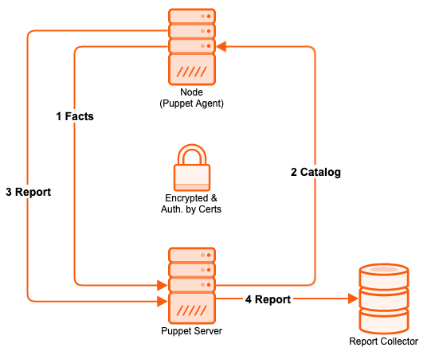
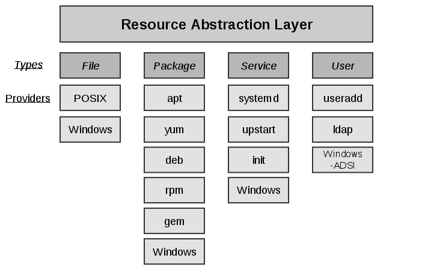

# Puppet Environment and Infrastructure

## Concept and Workflow

* Puppet is about abstraction
* Domain Specific Language allows for an abstract description of resources
  * Infrastructure as Code
  * Executable Documentation
* Define the desired state and not how to get there
  * Idempotence

  

### Idempotency

* Key point of Puppet
* No matter how often the same catalog is applied to a node, the state is still the same as after the first run.
* This means if several puppet runs are required to achieve the desired state, something is wrong.


## Impementations

### Puppet Core

* Emerged from Puppet Open Source
* Certified Puppet builds and guaranteed SLAs from vendor
* Developers or free users licence (EULA) available
* Chargeable licenses for 25 nodes or more

### OpenVox

* Open Source [community](https://github.com/openvoxproject) projekt forked from Puppet Open Source
* Started in the end of 2024
* Also offers all components as container images

### Puppet Enterprise

* Packaging for additional platforms including additional components
* Puppet Enterprise Console as Webinterface
* Additional Components
  * Puppet Node Manager - group nodes on facts
  * Puppet Code Manager - combines r10k, Jenkins and beaker for testing and deploying code
  * Puppet Configuration Manager - helps troubleshoot dependencies
  * Task Management - combines bolt with Puppet Enterprise Console and Orchestration API
  * File Sync - keep your environment synchronized over all your Puppet server
* Supported Modules
* Automated Provisioning for some platforms
* Vendor support and service

## Facter

* Facter returns (JSON format) key value pairs named facts
* It is used by Puppet to gather information about the node
* You can also run it on command line `puppet facts` to list facts

```bash
    {
      aio_agent_version: 7.18.0
      augeas: {
        version: "1.12.0"
      }
      disks: {
        vda: {
          size: "10.00 GiB",
          size_bytes: 10737418240,
          vendor: "0x1af4"
        }
      }
      ...
      system_uptime: {
        days: 0,
        hours: 2,
        seconds: 8378,
        uptime: "2:19 hours"
      }
      timezone: UTC
      virtual: kvm
```

To get a special value of the structured data, use for example:

```bash
    $ puppet facts disks.vda --render-as yaml
    ---
    disks.vda:
      size: "10.00 GiB",
      size_bytes: 10737418240,
      vendor: "0x1af4"

    $ puppet facts disks.vda.size
    {
      "disks.vda.size": "10.00 GiB"
    }
```

**Practice**:
* Log in to your student workstation
* Take a look at the issue of facter at your leisure
* Determine specific individual values, e.g.
  * os.family or os.release
  * networking or networking.ip
  * partitions

A sample solution can be found [here](./solutions/10_puppet_facter.md).

### External Facts

Writing your own facts to extend the functionality of facter.

* Locations
  * /opt/puppetlabs/facter/facts.d/
  * /etc/puppetlabs/facter/facts.d/
  * /etc/facter/facts.d/
  * or remeber later if you reach the chapter about modules
* simple text file

```bash
    key1=value1
    key2=value2
```

* Every executable that supplies to stdout key-value-pairs as
  * yaml
  * json
* Structured data as output is also pussible with executables
* use `puppet facts` to catch all facts also the external one, because
  * old `facter` cli returns core facts only
  * even if the `-p` option also includes your own written facts

```bash
    diff <(facter) <(facter -p)
    447a448
    > puppetversion => 8.14.0
```


## Puppet Agent

* Agent runs as service on all managed nodes
* Requests periodically the desired configuration state from the Puppet server
* Sends information about itself to determine the configuration state (facts)
* Enforces the retrieved configuration state (catalog)
* Report enforcement back to server
* Supported platforms:
  * most Linux distributions
  * Windows
  * many Unix distributions
  * Mac OS X
  * some Network devices

### Agent as Service

* Agent runs as a service
  * Interval is configureable
  * Splay can be added for spread agent runs
  * Default interval is 30 minutes
* Cronjob can be used as alternative
* On demand is also possible

### Configuration

* `/etc/puppetlabs/puppet/puppet.conf` (INI format)
* Use `puppet config print` shows the running and complete used configuration

```bash
    $ puppet config print
    agent_catalog_run_lockfile = /opt/puppetlabs/puppet/cache/state/agent_catalog_run.lock
    agent_disabled_lockfile = /opt/puppetlabs/puppet/cache/state/agent_disabled.lock
    allow_duplicate_certs = false
    allow_pson_serialization = false
    always_retry_plugins = true
    autoflush = true
    autosign = /etc/puppetlabs/puppet/autosign.conf
    basemodulepath = /etc/puppetlabs/code/modules:/opt/puppetlabs/puppet/modules
    ...
```

* or for only one special option:

```bash
    $ puppet config print ssldir
    /etc/puppetlabs/puppet/ssl
```

* On the same way you can set option with `puppet config set`

**Practice**
* Check out the current state of `report` that controls the sending of reports
* Change the behavoir
* After that take a look in the confiuguration file `puppet.conf`

A sample solution can be found [here](./solutions/15_puppet_config.md).

### Resources

With Puppet, everything that is managed is a resource or is traced back to one or more.

```puppet
    type { 'title':
      attribute1 => 'value1',
      ...
      attributeN => 'valueN',
    }
```

* Different types of resources have a differnt set of attributes
* But there are attributes, the so-called **meta attributes**, which exist for every resource type
* With **defined resources** you can define your own types to extend Puppet

### Example Managing User

* Managing a user without Puppet means managing:
  * Existence of user and attributes
  * Group membership
  * Home directory
* Requires knowledge of:
  * Installed tools (useradd or adduser)
  * Options of those tools (-g or -G)
  * Creating, changing, deleting requires different tools (useradd, usermod, userdel)
* Challenges for automation:
  * Scripting
  * Error handling and logging
  * Multiple platforms

```puppet
    user { 'icinga':
      ensure     => present,
      gid        => 'icinga',
      groups     => ['icingacmd'],
      home       => '/var/spool/icinga',
      shell      => '/sbin/nologin',
      managehome => true,
   }
```

### Resource Abstraction Layer

* Puppet uses a Resource Abstraction Layer
  * Groups similar resources into resource types
  * Resource types have multiple providers
* Resources can be declared always in the same fashion
* A resource will be managed by the best matching provider on the platform

A list can be generated with the `puppet describe -l` command!

  

#### Providers

* Availability of a provider is determinated by testing for availability of required binaries
* Can be marked as default for specific facts (typically operatingsystem)
* Can support all or only a subset of features a resource type requires
* Example for resource package
  * **Providers**: *aix appdmg apple apt aptitude aptrpm blastwave dnf dpkg fink freebsd gem hpux macports nim openbsd pkg pacman pip3 pip pkg pkgdmg pkgin pkgng pkgutil portage ports portupgrade puppet_gem rpm rug sun sunfreeware up2date urpmi windows yum zypper*
  * **Features**: *holdable install_options installable package_settings purgeable reinstallable uninstall_options unins
tallable upgradeable versionable virtual_packages*
* With the **meta parameter** `provider`, the provider can be explicitly selected for each resource

#### Puppet Resource Command

* Puppet provides a command to directly interact with the Resource Abstraction Layer
* Querying all or one resource of a type returns Puppet code representation of current state
* Setting attributes will change state using available provider

```puppet
    $ puppet resource package vim-enhanced
    package { 'vim-enhanced':
      ensure => 'purged',
    }
```

```puppet
    $ puppet resource package vim-enhanced ensure=present
    Notice: /Package[vim-enhanced]/ensure: created
    package { 'vim-enhanced':
      ensure => '7.4.160-1.el7',
    }
```

You get something similar to a man-page also with the `puppet describe` command!

**Practice**:
* Check current state of resource `chronyd` of type service
* Install package `vim-enhanced` if it is not already installed
* Add user `kermit` and remove him again
  * Use `puppet describe` to get more information about type `user`
  * Test the behavior with `managehome=true`

A sample solution can be found [here](./solutions/20_puppet_resource.md).
## Puppet Server

* The server runs on a central machine
* Includes a Certificate authority
* Authenticates agent connections
* Serves a compiled catalog with the desired configuration state on agent request
* Acts as file server
* Forwards reports to report handlers
* Puppet server runs jRuby (executed in a JVM)
* Supported on most Linux distributions

### Configuration

In the same way as for the agent. But with an additional section (INI) `server` for server options only.

### Deploying Code to Puppet Server

* Ensure code is valid
  * Syntax validation
  * Style guide conformity
* Use environments for staging
  * No direct deployment in production
* **Use a version control system**
  * History of changes
  * Enables Collaboration
  * Hooks or pipelines enable **automatic validation and deployment**


## PuppetDB

* Data Store:
  * Facts(last run)
  * Catalog (last run)
  * Reports (optional, timefram configurable)
* Enables:
  * Features like exported resources
  * API to query the data
* Uses:
  * Clojure (dialect of Lisp runs in JVM)
  * PostgreSQL


## Puppet Apply

* The Puppet apply command combines server and agent functionality
  * Takes a file containing Puppet code
  * Gathers information using facter
  * Compiles a catalog
  * Enforces the configuration
  * Can also run in simulation mode
* Useful for **development and local testing** or server-less setups
* Requires root privileges

