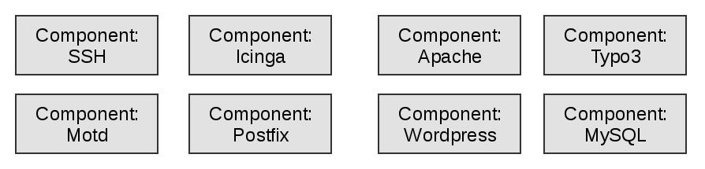
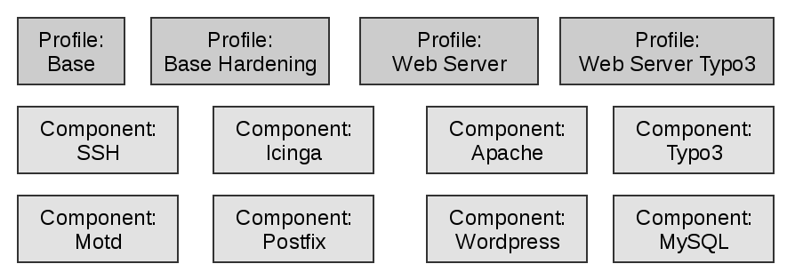
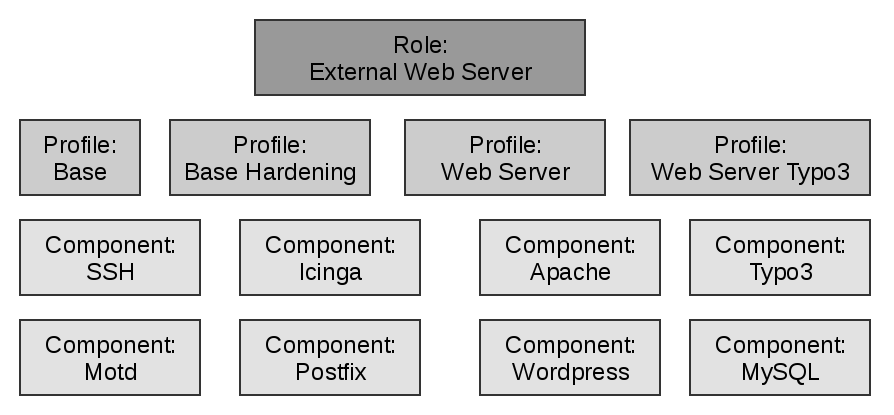

# Working with Puppet

In the following, some concepts are mentioned that will be explained and expanded later.

* A branch (git) holds a certain code state
* Each existing branch represents a Puppet environment
* Puppet agents can execute their runs against a specific environment
* A Puppet module extends the functionality of Puppet, e.g.
  * new facts
  * classes (a bundle of logically related resources)
  * and some other properties


## Rule everything: The Control Repository

* A version controlled repository (here we will use git)
* Each branch is automatically transferred to an environment
* Any desired Puppet module are installed automatically
* The entrypoint of each puppet run and the declaration of the desired state of the requesting node

We will now start with only one environment by working in one directory and the use of `puppet apply` to simulate the puppet workflow without having a server.

### Environments

* Environments allow to serve different code to different stages
* Directory enviroments
  * Path set on the server to serve an environment per directory
  * Directory contains a main manifest and modules
* Assignment
  * Node configuration requests an environment
  * Server can override it
* Default environment: production

```bash
    $ ls -l /etc/puppetlabs/code/environments/production
    data  environment.conf  hiera.yaml  manifests  modules Puppetfile
```

## Classification

### Manifest site.pp

* Nodes are another resource type
* Only objects not declared in modules
* Matching
  * Exact match
  * Regex, first not best match!
  * Default

```puppet
    # environments/production/manifests/site.pp

    node 'www.example.com' {
      include apache
    }

    node /www[0-9]+.example.com$/ {
      include nginx
    }

    node /.example.com$/ {
      include base
    }

    node default {
      notify { 'Node not configured': }
    }
```

**Practice**:

* Write a site.pp for your working node
* Use resource notify to display any text you want
* Run a `puppet apply` on manifest/site.pp

A sample solution can be found [here](./solutions/30_classification.md).

### External Node Classifier

* External Node Classifier (ENC) is an alternative to site.pp
* Script providing a node declaration in yaml format
  * Simple script logic
  * Query configuration management database
  * Communication with a web frontend


## Variables and Facts

**Syntax**:

```puppet
    $variable = 'value'

    $motd_file = '/etc/motd'
```

* Can be used in resource attributes, expression or functions
* Also be used as **resource title**
* Some naming conventions enforced, some keywords reserved
* Depending on scope

  

* Different data types
* Actually are constants!

**Interpolation**

```puppet
    $motd_file = "${conf_dir}/motd}"
```

**Practice**:

* Assign a variable with any value outside your node decrations in your `manifests/site.pp`
* Use this variable as title in your `notify` resource
* Run `puppet apply` on your `manifests/site.pp`
* Now add the same variable inside your node declaration and assign a differnt value
* Rerun `puppet apply` and compare the results

A sample solution can be found [here](./solutions/40_variables.md).

### Access to Variables in differnt scopes

Shortname accesses via resolving
```puppet
    $httpd_confdir
```

Qualified name accesses scope defined by namespace

* Top Scope
  * Former syntax to access a top scope variable
  * Do not use (best practice) the top scope anymore
```puppet
    $::motd_file
```
* Out-of-Scope
```puppet
    $apache:mod::status::extended_status
```

**Practice**:

* Replace again the title of your `notify` and use `$::motd_file`
* Rerun `puppet apply`

A sample solution can be found [here](./solutions/44_variables.md).

### Data Types

* Simple Data Types
  * Strings
  * Numbers
  * Booleans
  * Arrays
  * Hashes
  * Regular Expressions
  * Undef
  * Resource References
  * Default

```puppet
    $num  = 4711
    $bool = true
    $arr  = ['item1', 4711]
    $hsh  = { key1 => 'value1', key2 => 4711 }
```

* Abstract Data Types
  * Flexible Data Types
  * Parent Types

### Accessing variables

```puppet
    $scalar

    $arr[0|
    $arr[1][2|

    $hsh['key']
    $hsh['key1']['key2']

    $arr[0]['key']
    $hsh['key'][5]
```

### Facts

* All determined facts of a node are available as top scope variables during the compilation of the catalog:
```puppet
    $facts['os']['family']
```
* Since Puppet 8 this produces an error if the key does not exist, to get an `undef` instead use
```puppet
    fact('os')
    fact('os.family')
```

**Notice**: Access like `$::kernel` or `$::os['family']` is deprcated and will not be supported in the future.

* All trusted information such as certname or all other properties from the certifikate are also avaiable':

```puppet
    $trusted['certname']
```

**Notice**: `$trusted` is empty during a `puppet apply` if the node has no certificate!


## Modules

Modules usually offer the possibility to manage a service or an application as once instead of hundreds of single resources.

* Serve classes, each a group of several logically related resources
* This enables:
  * auto-loading of classes
  * auto-delivery of custom Puppet extensions
  * easy sharing with others
  * file-serving for templates and files

### Puppet Forge

*http://forge.puppet.com*

* Community platform for modules
  * Thousands of modules by many different authors
  * Searchable
  * Supported, Partner supported and Approved Modules
  * Number of Downloads and Scoring system
* Command Line Interface `puppet module`
  * Install
  * List installed modules

#### Working with the Forge

The GitHub repositories can also be used directly for the following.

* Use as there are
  * Documentation
  * Parameterized
  * Push changes upstream
  * Wrap around them
* Use as inspiration
  * Keep it simple

**Practice**:

* Importent: Change into your puppet working directory
* Search the forge for a module `motd`
* Use `puppet module install` to download and install the module motd into your `./modules` directory
* Check the content of your `./modules` directory

A sample solution can be found [here](./solutions/50_forge.md).

### Structure of Modules

```text
modulename
|-- facts.d        <- external facts
|-- files          <- static files
|-- functions      <- custom functions written in Puppet code
|-- lib
|   |-- facter     <- facts written in Ruby
|   `-- puppet     <- custom functions, types and providers
|-- manifests      <- Puppet classes
|-- metadata.json  <- Module description, especially module dependencies
|-- spec           <- unit tests
|-- templates      <- dynamic files in erb or epp syntax
|-- types          <- custom data types
`-- examples       <- smoke tests
```

### Puppetfile

* Specify which modules and data you wanna be installed
  * downloads modules from puppetforge
  * but also any data from any git repository
* For automation `r10k` from package `bolt` is used
* Caution: Dependencies are not automatically resolved
* But there is the tool `r10k-resolve` what supports you

```ruby
# optional the forge for downloads, default to
forge 'http://forge.puppetlabs.com'

mod 'puppetlabs/concat', :latest
mod 'puppetlabs/stdlib', '9.2.0'
mod 'puppet/systemd'

mod 'icinga',
    :git => 'https://github.com/voxpupuli/puppet-icinga'
    :tag => 'v6.0.1'
mod 'icinga2',
    :git => 'git@github.com:voxpupuli/puppet-icinga2.git'
    :branch => 'fix/344'
```

**Practice**:

* Create a `Puppetfile` in your working directory
* Add module `puppetlabs/motd` and its dependencies to your `Puppetfile`
* Remove all directores from directory `./modules/` via `rm -rf modules/*`
* Now execute `/opt/puppetlabs/bolt/bin/r10k puppetfile install -v` to reinstall the desired modules
* Check the content of the `./modules/` directory

A sample solution can be found [here](./solutions/54_puppetfile.md).


## Classes

Classes offering a way of grouping resources together and assigning data.

### Defining vs. Declaring

**Define**:
To specify the contents and behavior of a class. Defining a class doesn't automatically include it in a configuration; it simply makes it available to be declared.

```puppet
    class base (
      Boolean               $motd      = true,
      Stdlib::Absolutepath  $motd_file = '/etc/motd',
    ) {
      file { $motd_file:
        ensure => file,
        conatnet => 'Hello my friend!',
      }
      ...
    }
```

**Declare**:
To direct Puppet to include or instantiate a given class. To declare classes, use the include function. This tells Puppet to evaluate the class and manage all the resources declared within it.

* with include function

```puppet
    include base
```

* like any other resources, setting parameters are optional

```puppet
    class { 'base':
      motd_file => '/etc/motd.new',
    }
```

#### Idempotency of include

* The function include is idempotent. That means you can use the `include` of the same class several times in your code.

```puppet
    include base
    include base
```

* The class is declared just once, the first time it was used. Only works without setting parameters via manifest code.

**Notice**: A mix between the declaration with include and class doesn't work and passes to a duplicate declaration error.

### Namespaces

Namespaces are segments that identify the directory and file structure for classes:

| File path                        | Namespace             |
|----------------------------------|-----------------------|
| manifests/base.pp                | base                  |
| manifests/base/ssh.pp            | base::ssh             |
| manifests/linux/debian/apache.pp | linux::debian::apache |

Classes must correspond to the namespaces in its name.

```puppet
    class base::ssh {
      ...
    }

    include base::ssh
```

### Autoloading

Classes in module directory ***manifests***:

* Default class named like the module found in `init.pp`
* Classes in files matching there names
  * `module::example` in `example.pp`
  * `module::example::complex` in `example/complex.pp`

Static files in directory ***files***:

* Served by Puppet fileserver as `puppet:///modules/modulename/filename`

```puppet
    file { '/etc/motd':
      ensure => file,
      source => 'puppet:///modules/base/motd.txt',
    }
```

Templates directory in ***templates***:

* Lookup by Puppet template functions like
  * Embedded Ruby: 'template(modulename/filename.erb)'
  * Embedded Puppet: 'epp(modulename/filename.epp)'

**Practice**:

* Examine the `puppetlabs/motd` module
* and use it to manage a message of the day
* add your code to yout node declaration in `manifests/site.pp`

A sample solution can be found [here](./solutions/60_classes.md).

### Parameter Lookup

* Separation of configuration and data
* Automatic Lookup of parameters was introduced in Puppet 3
* Improvements in Puppet 4.9
* Default is
  * Hiera, a hierachical lookup
  * One global configuration


## Hiera

* Hierarchy of lookups is configurable
  * Hierarchy level can be fix or use variables
  * Hiera 4 was never released as stable, replaced in Puppet 4.9
  * Environment and module configuration uses Hiera 5
* Different backends are avaiable
  * YAML/JSON - default
  * EYAML - YAML with encrypted fields
  * EYAML-GPG - same but with GPG keys

```yaml
    ---
    version: 5
    defaults:
      # The default value for "datadir" is "data" under the same directory as the hiera.yaml
      # file (this file)
      # When specifying a datadir, make sure the directory exists.
      # See https://puppet.com/docs/puppet/latest/environments_about.html for further details on environments.
      # datadir: data
      # data_hash: yaml_data
    hierarchy:
      - name: "Per-node data (yaml version)"
        path: "nodes/%{::trusted.certname}.yaml"
      - name: "Other YAML hierarchy levels"
        paths:
          - "common.yaml"
```

**Notice**: Facts can also be used in `hiera.yaml` to control the lookup behavior!

**Practice**:

* Rewrite your node declarition to use only an `include motd` instead of a declaration with `class`
* Add key `motd::content` with any value to `data/common.yaml`
* Run `puppet aplly` and check the result
* Add a diffrent value to the same key in `data/nodes/<your certname>.yaml`
* Tip: To get the correct certname use `puppet config print certname`
* Rerun `puppet apply`

A sample solution can be found [here](./solutions/70_hiera.md).

**Bonus**:

* Add a new layer between *nodes* and *common.yaml* named `operatingsystem data (yaml version)` based on `facts.os.family`
* Add yaml file for the osfamily of your machine


## Roles-Profiles-Pattern

* Puppet is all about abstraction
* Wants to simplify things
* Good module design
  * compose system configuration
  * interchangeable
* Roles-Profiles-Pattern takes this to the next level
  * Component Modules - technical implementation
  * Profile - site specific implementation
  * Role - business logic

### Component Modules



```puppet
    class apache (
      $apache_name            = $::apache::params::apache_name,
      $service_name           = $::apache::params::service_name,
      $default_mods           = true,
      $default_vhost          = true,
      ...
    }
```

### Profile Module



* Declare resources and classes inside
* Parameters are welcome

```puppet
    class profile::base ( {
      String[1] $template = 'motd_base.erb',
    ) {
      include ssh
      include postfix::mta

      class { 'motd':
        template => "profile/${template}"
      }
      ...
    }
```

### Role Module (Optional)

Optional? Can also be mapped via hiera.



* Only includes profile classes
* Transfer parameters to prifile classes only via Hiera
* Parameterization of role classes is not permitted

```puppet
    class role::webserver::external {
      include profile::base::hardening
      include profile::webserver::typo3
    }
```

**Practice**:

* Create a dircetory `site-modules` in your working directory
* Add this one to the `modulepath` in the `environment.conf`
* Create a new module `profile` to the new path
* Add a class `base` to the new module
* Transfer the declarations from your `site.pp` to the new class
* and replace the declaration in your `site.pp` with your new class
* Run `puppet apply`

A sample solution can be found [here](./solutions/80_profile.md).


## Templates

Implemented by a function call:

* template
  * uses Embedded Ruby in templates
  * all variables in the scope are passed to the template
  * can handle multiple templates

```puppet
    template('file.erb')
```

* epp
  * uses Embedded Puppet in templates
  * a hash with parameter has to be passed to the template

```puppet
    epp('file.epp', { 'parameter' => 'value' })
```

* inline versions of both functions exists

### Functions

* Always executed on the server during Catalog Compilation (expect the Deferred function)
* Two types:
  * statement - executes an action
  * rvalue - returns a value
* Basic functions included in Puppet, e.g.:
  * fail - statement to fail catalog compilation with the provided message
  * template - rvalue returning an erb template as string
  * versioncmp - rvalue returning a number indicating if a version is higher or lower
* Additional functions can be provided by modules

### ERB Syntax

Simple textfile including some Ruby code:

```ruby
    <%# Comment not printed in file -%>

    <% if @variable == true -%>
    Print this <%= @variable %>
    <% end -%>

    <% @values.each do |value| -%>
    Value is <%= value %>
    <% end -%>
```

### EPP Syntax

Simple textfile including some Puppet code:

```puppet
    <%- | Boolean $variable = true,
          Array   $values
    | -%>
    <%# Comment not printed in file -%>

    <% if $variable == true { -%>
    Print this <%= $variable %>
    <% } -%>

    <% $values.each |value| { -%>
    Value is <%= value %>
    <% } -%>
```

**Notice**: This is puppet code, access to variables out of scope is possible!

**Practice**:

* Write an EPP template without parameterization for `motd` in your `profile` module
* Use some facts in your message
* Reconfigure your hiera data to use the template
* Run `puppet apply`

A sample solution can be found [here](./solutions/90_templates.md).

**Bonus**:

* Extend then template to output a variable from `profile::base` scope
