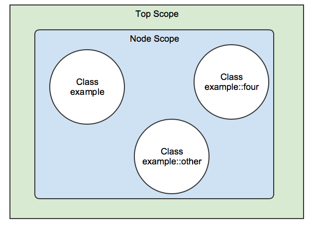

# Working with Puppet

In the following, some concepts are mentioned that will be explained and expanded later.

* A branch holds a certain code state
* Each existing branch represents a Puppet environment
* Puppet agents can execute their runs against a specific environment
* A Puppet module extends the functionality of Puppet, e.g.
  * new facts
  * classes (a bundle of logically related resources)
  * and some other properties


## Rule everything: The Control Repository

* A version controlled repository (here we will use git)
* Each branch is automatically transferred to an environment
* Any desired Puppet module are installed automatically
* The entrypoint of each puppet run and the declaration of the desired state of the requesting node

We will now start with only one environment by working in one directory and the use of `puppet apply` to simulate the puppet workflow without having a server.

### Environments

* Environments allow to serve different code to different stages
* Directory enviroments
  * Path set on the server to serve an environment per directory
  * Directory contains a main manifest and modules
* Assignment
  * Node configuration requests an environment
  * Server can override it
* Default environment: production

```bash
    $ ls -l /etc/puppetlabs/code/environments/production
    data  environment.conf  hiera.yaml  manifests  modules Puppetfile
```

## Classification

### Manifest site.pp

* Nodes are another resource type
* Only objects not declared in modules
* Matching
  * Exact match
  * Regex
  * Fuzzy name matching via wildcards
  * Default

```puppet
    # environments/production/manifests/site.pp

    node 'www.example.com' {
      include apache
    }

    node /.example.com$/ {
      include base
    }

    node 'www.example.*' {
      include nginx
    }

    node default {
      notify { 'Node not configured': }
    }
```

**Practice**:

* Write a site.pp for your working node
* Use resource notify to display any text you want
* Run a `puppet apply` on manifest/site.pp

### External Node Classifier

* External Node Classifier (ENC) is an alternative to site.pp
* Script providing a node declaration in yaml format
  * Simple script logic
  * Query configuration management database
  * Communication with a web frontend


## Variables and Facts

**Syntax**:

```puppet
    $variable = 'value'

    $motd_file = '/etc/motd'
```

* Can be used in resource attributes, expression or functions
* Also be used as **resource title**
* Some naming conventions enforced, some keywords reserved
* Depending on scope

  

* Different data types
* Actually are constants!

**Interpolation**

```puppet
    $motd_file = "${conf_dir}/motd}"
```

**Practice**:

* Assign a variable with any value outside your node decrations in your site.pp
* Use this variable as title in your `notify` resource
* Run `puppet apply` on your `manifests/site.pp`
* Now add the same variable inside your node declaration and assign a differnt value
* Rerun `puppet apply` and compare the results

### Access to Variables in differnt scopes

Shortname accesses via resolving
```puppet
    $httpd_confdir
```

Qualified name accesses scope defined by namespace

* Top Scope
```puppet
    $::kernel
```
* Out-of-Scope
```puppet
    $apache:mod::status::extended_status
```

**Practice**:
* Replace again the title of your `notify` and use `$::motd_file`
* Rerun `puppet apply`

### Data Types

* Simple Data Types
  * Strings
  * Numbers
  * Booleans
  * Arrays
  * Hashes
  * Regular Expressions
  * Undef
  * Resource References
  * Default

```puppet
    $num  = 4711
    $bool = true
    $arr  = ['item1', 4711]
    $hsh  = { key1 => 'value1', key2 => 4711 }
```

* Abstract Data Types
  * Flexible Data Types
  * Parent Types

### Accessing variables

```puppet
    $scalar

    $arr[0|
    $arr[1][2|

    $hsh['key']
    $hsh['key1']['key2']

    $arr[0]['key']
    $hsh['key'][5]
```

### Facts

* All determined facts of a node are available as top scope variables during the compilation of the catalog:

```puppet
    $facts['os']['family']
```

* All trusted information such as certname or all other properties from the certifikate are also avaiable':

```puppet
    $trusted['certname']
```

**Notice**: $trusted is empty during a `puppet apply`.


## Modules

Modules usually offer the possibility to manage a service or an application as once instead of hundreds of single resources.

* Serve classes, each a group of several logically related resources
* This enables:
  * auto-loading of classes
  * auto-delivery of custom Puppet extensions
  * easy sharing with others
  * file-serving for templates and files

### Puppet Forge

http://forge.puppet.com

* Community platform for modules
  * Thousands of modules by many different authors
  * Searchable
  * Supported, Partner supported and Approved Modules
  * Number of Downloads and Scoring system
* Command Line Interface `puppet module`
  * Search
  * Install
  * List installed modules

#### Working with the Forge

The GitHub repositories can also be used directly for the following.

* Use as there are
  * Documentation
  * Parameterized
  * Push changes upstream
  * Wrap around them
* Use as inspiration
  * Keep it simple

**Practice**:
* Importent: Change into your puppet environment directory
* Search the forge for a module `motd`
* Use commandline tool `puppet module` to insatll `motd` from *puppetlabs*
* Use `puppet module install` to download and install the module motd into your `./modules` directory
* Check the content of your `./modules` directory

### Puppetfile


