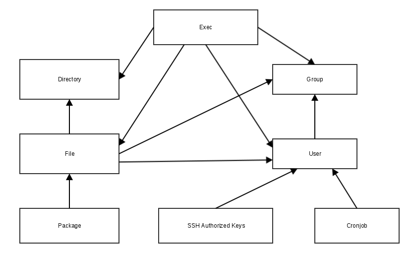
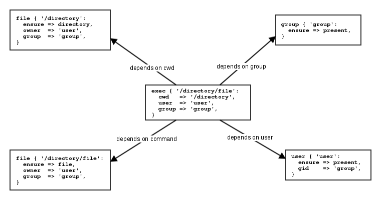
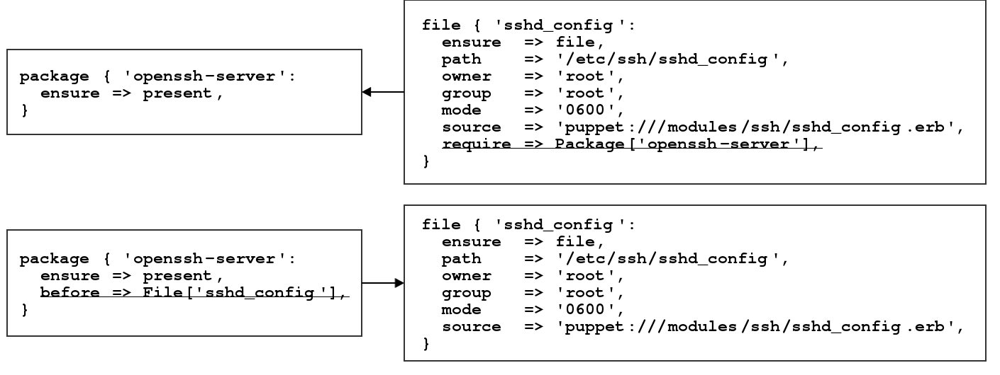
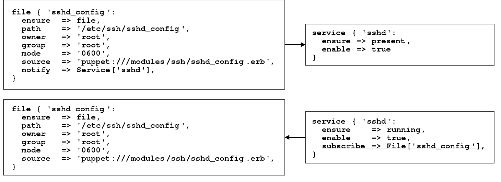

# Code Logic and Structure

## Resource Defaults and Blocks

* Puppet allows you to declare resource defaults

```puppet
    Type {
      attribute => 'value',
    }

    File {
      owner => 'root',
      group => 'root',
      mode  => '0644',
    }
```

**Notice**: For directories Puppet promotes a mode default of `0644` to `0755`.

* With Puppet 4 a block based version was introduced

```puppet
    file {
      default:
        mode   => '0600',
        owner  => 'root',
        group  => 'root',
        ensure => file,
      ;
      '/etc/ssh_host_key':
      ;
      '/etc/ssh_host_dsa_key.pub':
        mode => '0644',
      ;
    }
```

**Practice**:
* Create a custom directory structure in `/opt/myapp`
* Use several File resources of different types of `directory`, `file` and `link`


## Conditionals

* Puppet supports four types of conditionals
  * selectors
  * case statements
  * if statements
  * unless statements
* Can be used to
  * return values
  * alter code logic

**Notice**: All comparisons of strings in conditions are <ins>case insensitive</ins>!

### Selectors

* Good for assigning conditional values to variables

```puppet
    $apache_package = $facts['os']['family'] ? {
      'RedHat' => 'httpd',
      default  => 'apache2',
    }

    package { 'apache':
      ensure => installed,
      name   => $apache_package,
    }
```

### Case Statement

* Ideal for:
  * Setting multiple variables at once
  * Choosing different branches of code

```puppet
     case $facts['os']['family'] {
      'RedHat': {
        $apache_package = 'httpd'
        $apache_confdir = '/etc/httpd'
      }
      default: {
        $apache_package = 'apache2'
        $apache_confdir = '/etc/apache2'
      }
    }
```

### If Statement

* Used to make a choice based on a truth value
* Can use:
  * boolean value
  * conditional expressions
  * regular expressions
  * chain of expressions

```puppet
    if $ensure == 'present' or $ensure == 'installed' {
      package { 'telnet':
        ensure => present,
      }
    } elsif $ensure =~ /^(absent|purged)$/ {
      package { 'telnet':
        ensure => purged,
      }
    } else {
      fail("${ensure} is not valid")
    }
```

* Can also be used to assign variables directly

```puppet
   $_real_package_name = if $facts['os']['family'] == 'RedHat' {
     'httpd'
   } else {
     'apache2'
   }
```

### Unless Statement

* Reversed if statement
* No elsif clause possible

```puppet
    unless $ensure =~ /^(absent|purged)$/ {
      package { 'telnet':
        ensure => present,
      }
    } else {
      package { 'telnet':
        ensure => purged,
      }
    }
```

**Practice**:
* Add parameter `packages` (data type: Array) to your `profile::base`
* Use this parameter together with a condional to install different packages for diffierent OS families
* Have also a look at stdlib::ensure_packages
* Discuss file vs. ensure_packages


## Hiera Lookup Behavior

* By default the lookup returns the first match
* In addition to the automatic lookup, there is also a function
* First paramter is the key
* Last one the default to set if no key was found

```puppet
lookup('profile::base::packages')

lookup('profile::base::packages', undef, undef, [])
```

* Second sets the data type
* Third is for the behavior, default is `first`

```puppet
lookup('base::packages', Array[String], 'unique')
```

|Value   | Behavior                                                                        |
|--------|---------------------------------------------------------------------------------|
| first  | Returns the first value found, with no merging. The default                     |
| unique | Called array merge. You get a flattened array with all duplicate values removed |
| hash   | Return a merged hash. Without duplicate keys. Highest priority (level) win.     |
| deep   | Same like Hash. But recursively merge hash or array values.                     |

* Alternatively, a hash can be used for even finer configuration setting
  * `knockout_prefix` A string prefix to indicate a value should be removed from the final result. Default to `undef`.
  * `sort_merged_arrays` Whether to sort all arrays that are merged together. Default to `false`.
  * `merge_hash_arrays` Whether to merge hashes within arrays. Default to `false`.

```puppet
lookup({
  'name'  => 'profile::base::packages`,
  'merge' => {
    'strategy'         => 'deep',
    'merge_hash_array' => true,
  },
})
```

* Influencing the automatic parameter lookup
* Uses the hash method for configuration

```yaml
---
lookup_options:
  profile::base::users:
    merge: 'deep'
```

**Practice**:
* Add a new layer between nodes and common.yaml named `operatingsystem data (yaml version)` based on facts.os.family
* Replace the `case` statement in `profile::base` with a simple hiera lookup behavior change
* Use a node specific, os specific list of packages and a default one is `common.yaml`
* Choose a merge behavior and explain your decision

### Hiera Data Manager

TODO

### Classification

* Move classification to hiera

```yaml
---
classes:
  - profile::base
  - profile::apache
  - profile::postgresql::server
```

```puppet
node default {
  lookup('classes', Array[String], 'first').include
}
```

* Remember: There is a way to store and read trused information in and from the agent certificate
* Have a look at your certificate in `/etc/puppetlabs/puppet/ssl/certs` 

```bash
openssl x509 -in \<path to cert \> -noout -text
```

* Section `X509v3 extensions`

```text
            X509v3 Subject Key Identifier:
                EE:AD:98:3D:6D:B1:AE:43:EB:56:47:38:15:87:EC:CC:B0:7E:BD:C8
            1.3.6.1.4.1.34380.1.1.13:
                ..webserver
            1.3.6.1.4.1.34380.1.1.12:
                ..prod
            1.3.6.1.4.1.34380.1.1.20:
                ..hetzner
            1.3.6.1.4.1.34380.1.1.19:
                ..fsn1-dc14
            1.3.6.1.4.1.34380.1.1.8:
                ..training
            1.3.6.1.4.1.34380.1.1.21:
                ..lbetz-public.betadots.training
            1.3.6.1.4.1.34380.1.1.2:
                ..60288402
            1.3.6.1.4.1.34380.1.1.18:
                .
```

* `/etc/puppetlabs/puppet/csr_attributes.yaml` configures the certificate request
* Only works on the first agent run if no certificat exists yet
* Stored in `$trusted[extensions]` as hash

```yaml
---
extension_requests:
  pp_role: 'webserver'
  pp_environment: 'prod'
  pp_zone: 'hetzner'
  pp_datacenter: 'fsn1-dc14'
  pp_application: 'training'
  pp_network: 'lbetz-public.betadots.training'
  pp_instance_id: '60288402'
  pp_region: 'eu-central'
```

**Practice**:
* Add new layer for role after node specific and before os layer to your `hiera.yaml`
* Create a `webserver.yaml` for the role with a key `classes` (array) and item `profile::base`
* Set the merge behavior to `first`
* Do the required changes in your `site.pp` read and declare `$trusted['extensions']['pp_role']`
* Discuss the merge behavior `first` vs. `unique` for this use case
* Also discuss how to use `pp_environment` for a staging of your servers and roles


## Ordering

* Default order depends on <ins>order of declaration</ins> and implicit dependencies
* Ordering can be changed to:
    * Hash based ordering which was default in older versions
    * Random ordering to ensure all necessary dependencies are declared
* Dependencies can be set explicitly

### Implicit



### Implicit dependencies of `user`


#### Implicit dependencies of `exec`

* Resource to execute commands
* Avoid if possible
* If required use an attribute for idempotence
  * creates
  * onlyif / unless
  * refreshonly
* Use full path or provide path as attribute

```puppet
   exec { 'command':
     path        => '/usr/sbin/:/sbin/',
     refreshonly => true,
     timeout     => 60,
   }
```



### References

Allows to reference other managed resources

```puppet
    Type['title']

    Service['sshd']
```

The reference to a class consists of the keyword `Class` and its namespace:

```puppet
    Class['class namespace']

    Class['base::ssh']
```

Can be used to override parameters

```puppet
    file { ['/tmp/test', '/root/file.txt']:
      ensure  => file,
      owner   => 'root',
      group   => 'root',
      mode    => '0644',
      content => 'some content!',
    }

    File['/root/file.txt'] {
      mode    => '0640',
      content => 'Some different content.',
    }
```

**Note**: Using this sparingly to avoid confusion when everything is declared.

More commonly used to declare a sequence between different resources.

### Explicit

* 4 types of relationship
* Defined by metaparameter of all resources
* Simple Ordering:
  * require - referenced resource will be applied first
  * before - apply this resource before the reference
* Required for idempotency



* Refresh Events:
  * subscribe - if reference is changed refresh this resource
  * notify - if this resource is changed refresh the reference



### Dependency Chains

* Alternative syntax for explicit dependency
* Works great with references
* Simple Ordering:
  * before: Package['openssh-server'] -> File['sshd_config']
  * require: Package['openssh-server'] <- File['sshd_config']
* Refresh Events:
  * notify: File['sshd_config'] ~> Service['sshd']
  * subscribe: File['sshd_config'] <~ Service['sshd']
* For readability use before (->) and notify (~>)!

### Metaparameter

Metaparameters are attributes that work with any resource type. With metaparameters, you can change how Puppet handles specific resources.

* Add metadata to a resource with the `alias` or `tag` metaparameters
* Set limits on when the resource should be applied, e.g. `notify` or `require`
* Prevent Puppet from making changes, by setting the `noop` to `true`
* Change logging verbosity with `loglevel`


## Iterations

 Puppet comes with some iteration functions
  * each - repeat a code block for each object
  * slice - repeat a code block a given number of times
  * filter - remove non-matching elements
  * map - transform values to some data structure
  * reduce - combine values to a new data structure
  * with - create a private code block (no real iteration)

```puppet
    $binaries = ['facter', 'puppet', 'r10k']

    $binaries.each |String $binary| {
      file {"/usr/bin/${binary}":
        ensure => link,
        target => "/opt/puppetlabs/bin/${binary}",
      }
    }
```
