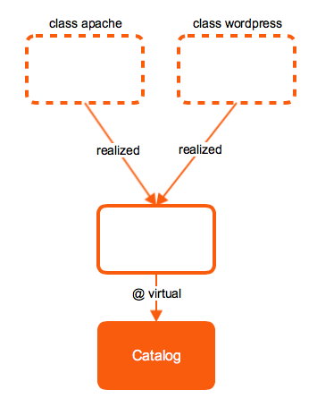
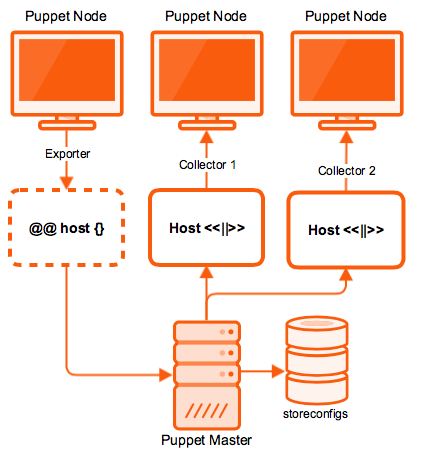

# Advanced Resources

## Resources Type

* Metatype that can manage other resource types
* Purge unmanaged resources

Example usage:

```puppet
resources { 'user':
  purge              => true,
  unless_system_user => true,
}
```

Help:

```console
$ puppet describe resources
```

## Virtual Resources

* Specifies a desired state for a resource without necessarily enforcing that state
* Manage the resource by realizing it elsewhere in your manifests
* Virtual resources can only be declared once
* Can be realized any number of times



Declare resources as virtual:

```puppet
@package { 'gcc':
  ensure => present
}
```

Realize virtual resources:

```puppet
realize Package['gcc']
```

Realize with collector:

Select a group of resources by searching the attributes of every resource in the catalog.

```puppet
Type <| [Attribute] [Search Expression] [Search Key] |>
```

All virtual user resources:

```puppet
User <||>
```

All system administrators:

```puppet
User <| groups == 'sysadmin' |>
```

All users tagged with `berlin`:

```puppet
User <| tag == 'berlin' |>
```

### Search Expressions

* == (equality search)

  Match if the value of the attribute is identical to the search key

* != (non-equality search)

  Match if the value of the attribute is not identical to the search key

* and

  Both operands must be search expressions that evaluate as true

* or

  Either operand can be a search expression that evaluates as true

### Example

The users tim, martin, robert will be created, but marcus will not:

```puppet
@user { 'tim': ensure => present, }

@user { 'martin':
  ensure => present,
  groups  => 'dba',
}

@user { 'robert':
  ensure => present,
  groups  => 'sysadmins',
}

@user { 'marcus':
  ensure => present,
  groups  => 'webadmins',
}

User <| (groups == 'dba' or groups == 'sysadmins')
        or title == 'tim' |>
```

### To provide defaults (will override attributes)

```puppet
User <| group == sysadmin |> {
  shell => '/usr/bin/bash',
}

Package <||> {
  provider => 'yum',
}
```

## Exported Resources

* Export resources to a database (Feature stored config, e.g. OpenVoxDB)
* Collect and use them on other nodes



Declare exported resources:

```puppet
@@sshkey { $hostname:
  type => ed25519,
  key  => $ssh_ed25519_key,
}
```

Collect exported resources:

```puppet
Sshkey <<||>>
```
