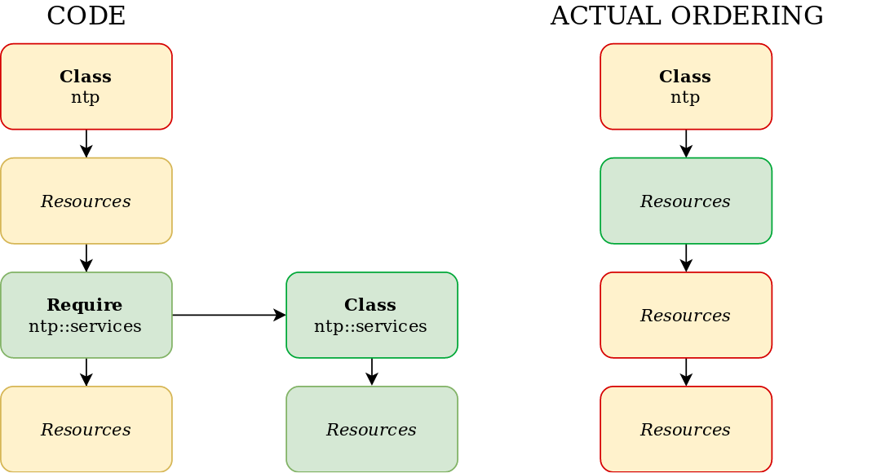
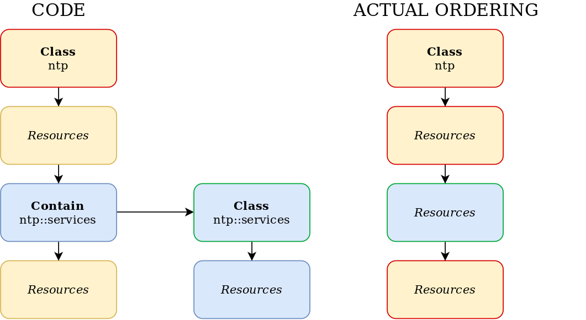
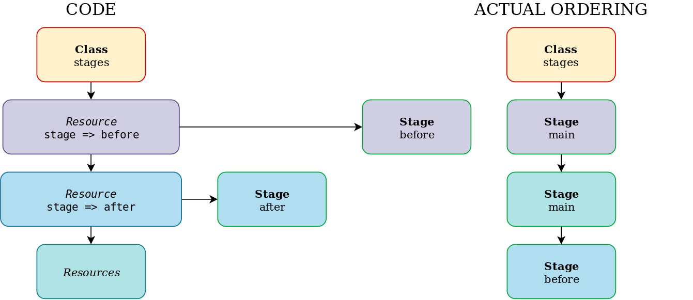

# Ordering

## Resource Relationships

The preferred way:

```puppet
Package['ntp'] -> File['/etc/ntp.conf'] ~> Service['ntpd']
```

Equal to:

```puppet
package { 'ntp':
  ensure => present,
}

-> file { '/etc/ntp.conf':
  ensure => file,
  mode   => '0640',
  source => 'puppet:///modules/ntp/ntp.conf',
}

~> service { 'ntpd':
  ensure => running,
  enable => true,
}
```

Same as (but not good style according to the style guide):

```puppet
Service['ntpd'] <~ File['/etc/ntp.conf'] <- Package['ntp']
```

## include Function

```puppet
class wordpress {
  include apache
  include mysql
  ...
}
```

* Enforcement order can be unpredictable and surprising
* Classes (resources) in other classes are unordered

TODO: Bild passt nicht.


## require Function

```puppet
class wordpress {
  require apache
  require mysql
  ...
}
```

* Declares a class and causes it to become a dependency of the surrounding container
* Every **resource** in the `apache` and `mysql` is applied before any **resource** in `wordpress`

TODO: Bild passt nicht.



## Problem of Containing Classes

```puppet
Class['repositories'] -> Class['ntp']

class repositories {
  yumrepo { 'custom':
    ...
  }
}

class ntp {
  Class['ntp::install'] -> Class['ntp::config'] ~> Class['ntp::service']

  include ntp::install
  include ntp::config
  include ntp::service 
}
```

* Resources are contained inside the classes they are declared in
* All resources in `repositories` are enforced before all resources in `ntp`
* **But** all resources in the included classes **don't** belong to `ntp`

### contain Function

```puppet
class ntp {
  Class['ntp::install'] -> File['/etc/ntp.conf'] ~> Class['ntp::service']

  contain npt::install
  contain ntp::service

  file { '/etc/ntp.conf':
    ...
  }
  ...
}
```

* Declare the class with include-like behavior of idemptence
* Contained by the surrounding class
* Replace the anchor resource



## Summary of Declaring Classes

* include
  * Ensures that the named class is included
  * Sets no ordering relationships
* require
  * Ensures that the named class is included
  * Also ensure that the named class is enforced before the current one
* contain
  * Ensures that the named class is included
  * And that all resources of the named class belongs also to the current one

## Stages

Outdated. Is solved today conceptually by good module design.

Metaparameter:

```puppet
class stages {
  stage { 'before':
    before => Stage['main'],
  }
  
  stage { 'after':
    require => Stage['main'],
  }
}
```

Chaining arrows:

```puppet
class stages {
  stage { [ 'before', 'after']: }

  Stage['before'] -> Stage['main'] -> Stage['after']
}
```



```puppet
class webserver {
  include stages
  include packages # Gets Stage['main'] by default

  class { 'repositories':
    stage => 'before',
  }

  class { 'ntp':
    stage => 'after',
  }
}
```

## Optional Usage of Resource Collectors

```puppet
Yumrepo['epel'] -> Package <||>

Apt::source['voxpupuli'] -> Package <| tag == 'puppet' |>
```
