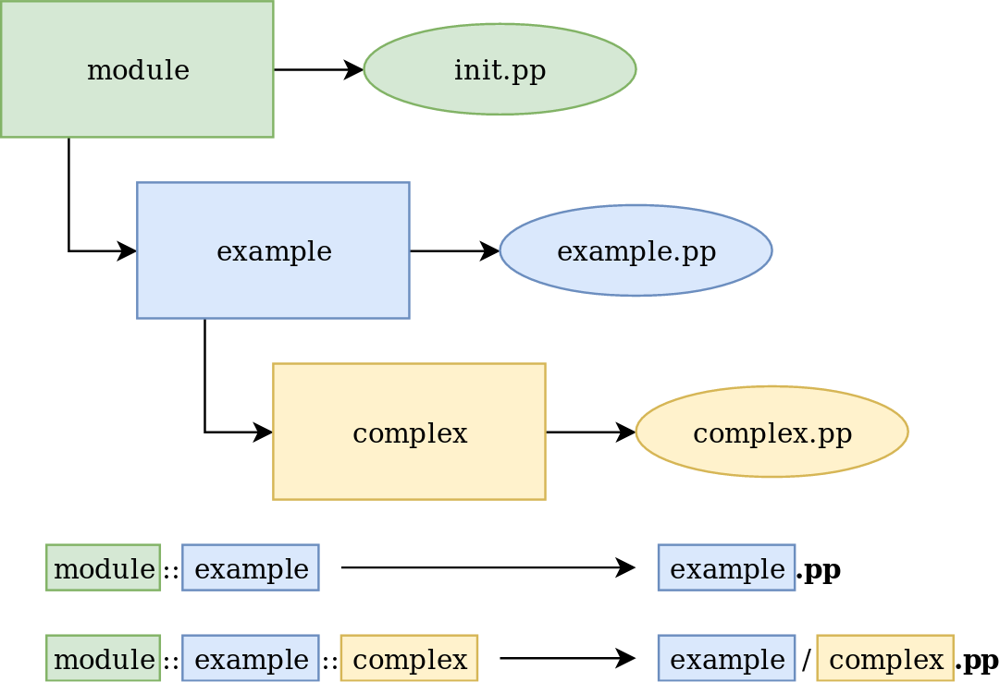

# Basic Review

## Facter

* Facter returns key value pairs named facts
* It is used by Puppet to gather information about the node
* You can also run it on command line to list facts

```consol2
augeas => {
  version => "1.12.0"
}
disks => {
  vda => {
    size => "10.00 GiB",
    size_bytes => 10737418240,
    vendor => "0x1af4"
  }
}
...

system_uptime => {
  days => 0,
  hours => 2,
  seconds => 8378,
  uptime => "2:19 hours"
}
timezone => UTC
virtual => kvm
```

## OpenVox/Puppet Run Cycle


## Resources

```puppet
package { 'httpd':
  ensure => installed,
}

file { '/etc/httpd/conf/httpd.conf':
  ensure => file,
  owner  => 'root',
  group  => 'root',
  source => 'puppet:///modules/apache/httpd.conf',
}

service { 'httpd':
  ensure => running,
  enable => true,
}
```

* Resources are building blocks
* They can be combined to make larger components
* Together they can model the expected state of your system

### Resource Defauls

* Scope defaults

  ```puppet
  File {
    owner => 'root',
    mode  => '0644',
  }
  ```

* Block based defaults

  ```puppet
  File {
    default:
      mode   => '0600',
      owner  => 'root',
      group  => 'root',
      ensure => file,
    ;
    '/etc/ssh_host_key':
    ;
    '/etc/ssh_host_dsa_key.pub':
      mode => '0644',
    ;
  }
  ```

### References

TODO

### Resource Relationships

```puppet
package { 'httpd':
  ensure => installed,
}

file { '/etc/httpd/conf/httpd.conf':
  ensure  => file,
  owner   => 'root',
  group   => 'root',
  source  => 'puppet:///modules/apache/httpd.conf',
  require => Package['httpd'],
}

service { 'httpd':
  ensure    => running,
  enable    => true,
  subscribe => File['/etc/httpd/conf/httpd.conf'],
}
```

* Puppet does enforce resources top down
* Four meta-parameters to define relationships (before, subscribe, require and notify)
* Alternatively with (`->, ~>, <~, <-`) between declarations or references

#### Implicit Dependency


### Resource Abstraction Layer


### Resource Command

```puppet
$ puppet resource package vim-enhanced
package { 'vim-enhanced':
  ensure => 'purged',
}

$ sudo puppet resource package vim-enhanced ensure=present
Notice: /Package[vim-enhanced]/ensure: created
package { 'vim-enhanced':
  ensure => '7.4.160-1.el7',
}
```

* Puppet provides a command to directly interact with the Resource Abstraction Layer
* Querying all or one resource of a type returns Puppet code representation of current state
* Setting attributes will change state using available provider

## Hiera

TODO

## Variables

* Assignment:

  ```puppet
  $variable = 'value'
  $httpd_confdir = '/etc/httpd'
  ```

  **Note**: No reassignment!

* Local Scope:

  ```puppet
  $httpd_confd_dir = "${httpd_confdir}/conf.d"
  ```

* Facts and trusted Facts

  ```puppet
  $facts['os']['name']
  $trusted['certname']
  ```

  * Out-of-Scope:

  ```puppet
  $apache::mod::ssl::ssl_cert
  ```

### Data Structures

TODO
integer, float, string, array, hash

Operators: `==, !=, >, <, >=, <=, ~=`

**Note**: String comparisons are case insensitive!

### Conditionals

* Selectors
* Case statements
* If statements
* Unless statements

Example:

Use always an `default` or `else` (if/unless statement).

```puppet
case $facts['os']['family'] {
  'redhat': {
    $package = 'httpd'
    $config  = '/etc/httpd/conf/httpd.conf'
    $service = 'httpd'
  }
  'debian': {
    $package = 'apache2'
    $config  = '/etc/apache2/apache2.conf'
    $service = 'apache2'
  }
  default: {
    fail('Your operatingsystem is not supported!')
  }
}
```

## Functions

* Always executed on the Master during Catalog Compilation
* Two types:
  * Statement - Executes an action and does not return arguments (fail, notice, etc.)
  * rvalue - Returns a value (template, versioncmp, etc.)

### ERB Templates

Manifest:

```puppet
$servername = $facts['networking']['fqdn']

file { $config:
  ensure => file,
  owner  => 'root',
  group  => 'root',
  content => template('apache/httpd.conf.erb'),
}
```

Embedded Ruby Template:
```ruby
...
<% if @servername != nil -%>
ServerName <%= @servername %>
<% else -%>
ServerName "not-defined"
<% end -%>
...
```

### EPP Templates

Manifest:

```puppet
$servername = $facts['networking']['fqdn']

file { $config:
  ensure => file,
  owner  => 'root',
  group  => 'root',
  content => epp('apache/httpd.conf.epp', {
      servername => $servername
  }),
}
```

Embedded Puppet Template:

```puppet
<%- | String $servername = "localhost" | -%>
...
<% if $servername != undef { -%>
ServerName <%= $servername %>
<% } else { -%>
ServerName "not-defined"
<% } -%>
...
```

## Modules and Classes

### Module Layout

```text
 {MODULE NAME}
 |-- examples       <- Smoke tests
 |-- facts.d        <- External facts
 |-- files          <- Static files
 |-- lib            <- Plugins
 |   |-- facter     <- Custom facts
 |   `-- puppet     <- Custom functions, types and providers
 |-- manifests      <- Puppet classes
 |   `-- init.pp    <- Main manifest file
 |-- metadata.json  <- Module description
 |-- README.md      <- Readme file
 |-- spec           <- Unit tests
 `-- templates      <- Dynamic files in ERB or EPP syntax
```

### Class Syntax

* Definition:

  ```puppet
  class apache(
    Stdlib::Ensure::Service $ensure = 'running',
    Boolean                 $enable = true,
  ) {
    package { 'httpd':
      ensure => installed,
    }
  
    file { '/etc/httpd/conf/httpd.conf':
      ensure => file,
      owner  => 'root',
      group  => 'root',
      source => 'puppet:///modules/apache/httpd.conf',
    }
  
    service { 'httpd':
      ensure => $ensure,
      enable => $ensble,
    }
  }
  ```

* Declaration:

  ```puppet  
  include apache

  class { 'apache': }
  ```

  with parameter:

  ```puppet
  class { 'apache':
    enable => false,
  }
  ```

  **Alternatively** in hiera (automatically parameter lookup) and declariotion via `include`!

* Reference:

  ```puppet
  Class['apache']
  ```

### Defined Resources

* Very similar to parameterized classes
* But can be used multiple times

* Definition:

  ```puppet
  define apache::vhost(
    Enum['present','absent'] $ensure    = present,
    String[1]                $vhostname = $title,
    Optional[String[1]]      $docroot   = undef,
  ) {
    require apache
  
    $vhostdir = $apache::vhostdir
  
    if $docroot {
      $vhost_docroot = $docroot
    } else {
      $vhost_docroot = "${vhostdir}/${vhostname}"
    }
    file { "${vhostdir}/${vhostname}.conf":
      ensure  => file,
      content => epp('apache/vhost.conf.erb'),
      notify  => Service['httpd'],
    }
  }
  ```

* Declaration:

  ```puppet
  apache::vhost { 'training.openvox.org':
    ensure  => present,
    docroot => '/var/www/training',
  }
  ```

* Reference

  ```puppet
  Apache::Vhost['training.openvox.org']
  ```

### Autoloading

Classes in `./manifests`

* Default class (main manifest) named like the module found in init.pp
* Classes in files matching there names
  * module::example in example.pp
  * module::example::complex in example/complex.pp




Files in `./files`

* Served by Puppet fileserver as `puppet:///modules/{MODULE NAME}/{FILE NAME}`

Templates in `./templates`

* Lookup by Puppet template functions like
  * Embedded Ruby (ERB): template("{MODULE NAME}/{TEMPLATE NAME}.erb")
  * Embedded Puppet (EPP): epp("{MODULE NAME}/{TEMPLATE NAME}.epp")

## Iterations or Loops

Implemented as lambda functions.

```puppet
$binaries = ["facter", "hiera", "bolt", "puppet"]

$binaries.each |String $binary| {
  file { "/usr/bin/${binary}":
    ensure => link,
    target => "/opt/puppetlabs/bin/${binary}",
  }
}
```

* Introduced in Puppet 4
* Different lambda functions
  * each - repeat a code block for each object
  * slice - repeat a code block a given number of times
  * filter - remove non-matching elements
  * map - transform values to some data structure
  * reduce - combine values to a new data structure
  * with - create a private code block (no real iteration)

## Puppet Apply Command

```console
$ sudo puppet apply --noop apache/examples/init.pp
Notice: /Stage[main]/Apache/Package[httpd]/ensure:
 current_value absent, should be present (noop)
...
Notice: Finished catalog run in 0.20 seconds

$ sudo puppet apply apache/examples/init.pp
Notice: /Stage[main]/Apache/Package[httpd]/ensure: created
Notice: /Stage[main]/Apache/Service[httpd]/ensure:
  ensure changed 'stopped' to 'running'
Notice: Finished catalog run in 8.94 seconds
```

* The Puppet apply command combines server and agent functionality
  * Takes a file containing Puppet code
  * Gathers information using Facter
  * Compiles a catalog
  * Enforces the configuration
  * Can also run in simulation mode
* Useful for development and local testing or server-less setups

