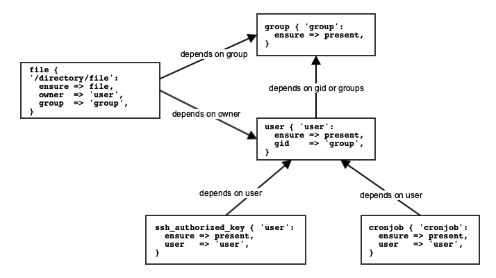
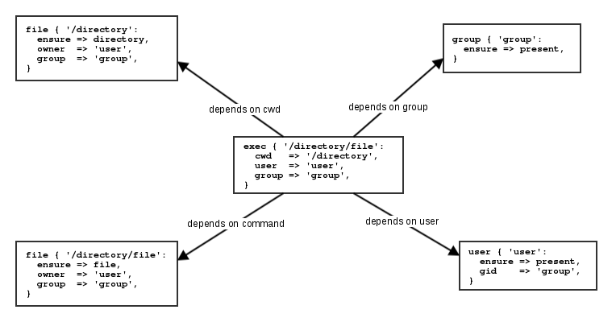
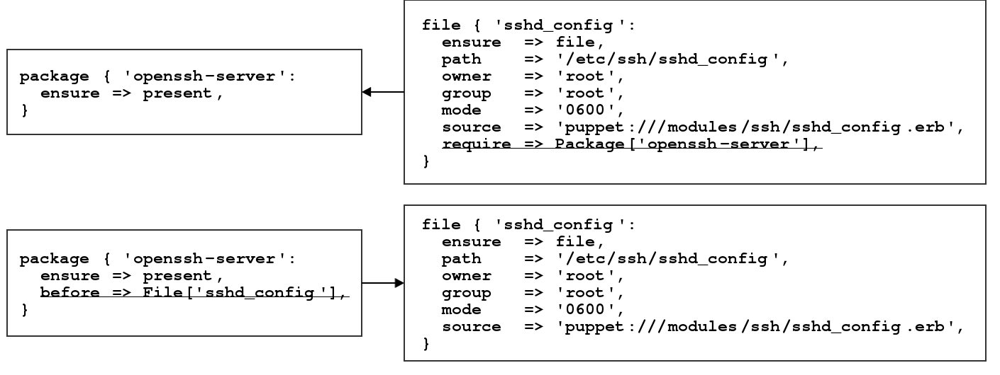
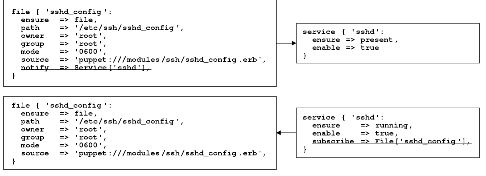

# Puppet DSL

TODO daily goal

## Resources

* Puppet includes in its installation some core resource types, for example:
    * user
    * group
    * file
    * package
    * service
* Additional ones can be provided by extenntions, with so-called modules, for example:
    * file_line
    * ini_setting
    * mysql_database
    * vcsrepo

A list can be generated with the `puppet describe` command!

### Syntax and Style

Puppet is as much about syntax as about style

```puppet
    type { 'title':
      ensure          => present,
      attribute       => 'value',
      other_attribute => 'anaothe rvalue',
    }
    
    file { ['/tmp/test', '/root/file.txt']:
      ensure  => file,
      owner   => 'root',
      group   => 'root',
      mode    => '0644',
      content => 'some content!',
    }
```

### Exec Resource

* Resource to execute commands
* Avoid if possible
* If required use an attribute for idempotence
  * creates
  * onlyif / unless
  * refreshonly
* Use full path or provide path as attribute

```puppet
   exec { 'command':
     path        => '/usr/sbin/:/sbin/',
     refreshonly => true,
     timeout     => 60,
   }
```
   
### Resource Defaults and Blocks

* Puppet allows you to declare resource defaults

```puppet
    Type {
      attribute => 'value',
    }

    File {
      owner => 'root',
      group => 'root',
      mode  => '0644',
    }
```

For directories Puppet promotes a mode default of `0644` to `0755`.

* With Puppet 4 a block based version was introduced

```puppet
    file {
      default:
        mode   => '0600',
        owner  => 'root',
        group  => 'root',
        ensure => file,
      ;
      '/etc/ssh_host_key':
      ;
      '/etc/ssh_host_dsa_key.pub':
        mode => '0644',
      ;
    }
```   

### References

Allows to reference other managed resources

```puppet
    Type['title']

    Service['sshd']
```

Can be used to override parameters

```puppet
    file { ['/tmp/test', '/root/file.txt']:
      ensure  => file,
      owner   => 'root',
      group   => 'root',
      mode    => '0644',
      content => 'some content!',
    }

    File['/root/file.txt'] {
      mode    => '0640',
      content => 'Some different content.',
    }
```

**Note**: Using this sparingly to avoid confusion when everything is declared.

More commonly used to declare a sequence between different resources.

### Ordering

* Default order depends on order of declaration and implicit dependencies
* Ordering can be changed to:
    * Hash based ordering which was default in older versions
    * Random ordering to ensure all necessary dependencies are declared
* Dependencies can be set explicitly

#### Implicit


#### Implicit dependencies of `user`



#### Implicit dependencies of `exec`



#### Explicit

* 4 types of relationship
* Defined by metaparameter of all resources
* Simple Ordering:
  * require - referenced resource will be applied first
  * before - apply this resource before the reference



* Refresh Events:
  * subscribe - if reference is changed refresh this resource
  * notify - if this resource is changed refresh the reference



#### Dependency Chains

* Alternative syntax for explicit dependency
* Works great with references
* Simple Ordering:
  * before: Package['openssh-server'] -> File['sshd_config']
  * require: Package['openssh-server'] <- File['sshd_config']
* Refresh Events:
  * notify: File['sshd_config'] ~> Service['sshd']
  * subscribe: File['sshd_config'] <~ Service['sshd']
* For readability use before (->) and notify (~>)!

### Metaparameter

TODO

## Classes

Classes offering a way of grouping resources together and assigning data.

### Defining vs. Declaring

**Define**:
To specify the contents and behavior of a class. Defining a class doesn't automatically include it in a configuration; it simply makes it available to be declared.

```puppet
    class base {
      file { '/etc/motd':
        ensure => file,
        conatnet => 'Hello my friend!',
      }
      ...
    }
```

**Declare**:
To direct Puppet to include or instantiate a given class. To declare classes, use the include function. This tells Puppet to evaluate the class and manage all the resources declared within it.

* with include function

```puppet
    include apache
```

* like any other resources

```puppet
    class { 'apache': }
```

#### Idempotency of include

* The function include is idempotent. That means you can use the `include` of the same class several times in your code.

```puppet
    include apache
    include apache
```

* The class is declared just once, the first time it was used.

**Notice**: A mix between the declaration with include and class doesn't work and passes to a duplicate declaration error.

### Namespaces

Namespaces are segments that identify the directory and file structure for classes:

| File path                        | Namespace             |
|----------------------------------|-----------------------|
| manifests/base.pp                | base                  |
| manifests/base/ssh.pp            | base::ssh             |
| manifests/linux/debian/apache.pp | linux::debian::apache |

Classes must correspond to the namespaces in the name.

```puppet
    class base::ssh {
      ...
    }

    include base::base
```

### Refernces of Classes

The reference to a class consists of the keyword `Class` and its namespace:

```puppet
    Class['class namespace']

    Class['base::ssh']
```

## Variables

**Syntax**:

```puppet
    $variable = 'value'

    $httpd_confdir = '/etc/httpd'
```

* Can be used in expressions, functions and resource attributes
* Some naming conventions enforced, some keywords reserved
* Depending on scope

  

* Different data types
* Actually are constants!

### Data Types

* Simple Data Types
  * Strings
  * Numbers
  * Booleans
  * Arrays
  * Hashes
  * Regular Expressions
  * Undef
  * Resource References
  * Default

```puppet
    $num  = 4711
    $bool = true
    $arr  = ['item1', 4711]
    $hsh  = { key1 => 'value1', key2 => 4711 } 
```

* Abstract Data Types
  * Flexible Data Types
  * Parent Types

### Accessing Variables

Shortname accesses Local Scope
```puppet
    $httpd_confdir
```

Qualified name accesses scope defined by namespace

* Top Scope and Node Scope
```puppet
    $::kernel
```
* Out-of-Scope
```puppet
    $apache:mod::status::extended_status
```

Interpolation

```puppet
    $httpd_confdir = "${conf_dir}/httpd}"
```

Array item and hash value

```puppet
    $arr[0]

    $hsh['key']
``` 

### Facts

* All determined facts of a node are available as top scope variables during the compilation of the catalog:

```puppet
    $facts['kernel']
```

* All trusted information such as certname or all other properties from the certifikate are also avaiable':

```puppet
    $trusted['certname']
```

**Notice**: $trusted is empty during a `puppet apply`.

### Conditionals

* Puppet supports four types of conditionals
  * selectors
  * case statements
  * if statements
  * unless statements
* Can be used to
  * return values
  * alter code logic

#### Selectors

* Good for assigning conditional values to variables

```puppet
    $apache_package = $facts['os']['family'] ? {
      'RedHat' => 'httpd',
      default  => 'apache2',
    }

    package { 'apache':
      ensure => installed,
      name   => $apache_package,
    }
```

#### Case Statement

* Ideal for: 
  * Setting multiple variables at once
  * Choosing different branches of code

```puppet
     case $facts['os']['family'] {
      'RedHat': {
        $apache_package = 'httpd'
        $apache_confdir = '/etc/httpd'
      }
      default: {
        $apache_package = 'apache2'
        $apache_confdir = '/etc/apache2'
      }
    }
```

#### If Statement

* Used to make a choice based on a truth value
* Can use:
  * boolean value
  * conditional expressions
  * regular expressions
  * chain of expressions

```puppet
    if $ensure == 'present' or $ensure == 'installed' {
      package { 'telnet':
        ensure => present,
      }
    } elsif $ensure =~ /^(absent|purged)$/ {
      package { 'telnet':
        ensure => purged,
      }
    } else {
      fail("${ensure} is not valid")
    }
```

* Can also be used to assign variables directly

```puppet
   $_real_package_name = if $facts['os']['family'] == 'RedHat' {
     'httpd'
   } else {
     'apache2'
   }
```

#### Unless Staement

* Reversed if statement
* No elsif clause possible

```puppet
    unless $ensure =~ /^(absent|purged)$/ {
      package { 'telnet':
        ensure => present,
      }
    } else {
      package { 'telnet':
        ensure => purged,
      }
    }
```

### Parameterized Classes

* Classes can take parameters to change their behaviour
* The parameters should have a defined data type
* Also with parameters a class is still a singleton

```puppet
    class apache (
      Enum['running','stopped'] $ensure        = 'running',
      Boolean                   $enable        = true,
      Boolean                   $default_vhost = false,
      Hash[String, String]      $vhosts        = {},
    ) {
      ...
    }
```

**Declaring parameterized class**:

* Include function takes a class with all its defaults
* You can declare a class like every resource with parameters

```puppet
    class { 'apache':
      ensure        => running,
      default_vhost => true,
    }
```

## Functions

* Always executed on the server during Catalog Compilation
* Two types:
  * statement - executes an action
  * rvalue - returns a value
* Basic functions included in Puppet, e.g.:
  * fail - statement to fail catalog compilation with the provided message
  * template - rvalue returning an erb template as string
  * versioncmp - rvalue returning a number indicating if a version is higher or lower
* Additional functions can be provided by modules

### Iteration

* Puppet comes with some iteration functions
  * each - repeat a code block for each object
  * slice - repeat a code block a given number of times
  * filter - remove non-matching elements
  * map - transform values to some data structure
  * reduce - combine values to a new data structure
  * with - create a private code block (no real iteration)

```puppet
    $binaries = ['facter', 'hiera', 'mco', 'puppet', 'puppetserver']

    $binaries.each |String $binary| {
      file {"/usr/bin/${binary}":
        ensure => link,
        target => "/opt/puppetlabs/bin/${binary}",
      }
    }
```   

## Templates

Implemented by a function call:

* template
  * uses Embedded Ruby in templates
  * all variables in the scope are passed to the template
  * can handle multiple templates

```puppet
    template('file.erb')
```

* epp
  * uses Embedded Puppet in templates
  * a hash with parameter has to be passed to the template

```puppet
    epp('file.epp', { 'parameter' => 'value' })
```

* inline versions of both functions exists

### ERB Syntax

Simple textfile including some Ruby code:

```ruby
    <%# Comment not printed in file -%>

    <% if @variable == true -%>
    Print this <%= @variable %>
    <% end -%>

    <% @values.each do |value| -%>
    Value is <%= value %>
    <% end -%>
```

### EPP Syntax

Simple textfile including some Puppet code:

```puppet
    <%- | Boolean $variable = true,
          Array   $values
    | -%>
    <%# Comment not printed in file -%>

    <% if $variable == true { -%>
    Print this <%= $variable %>
    <% } -%>

    <% $values.each |value| { -%>
    Value is <%= value %>
    <% } -%>
``` 

## Defined Resources

* Very similar to parameterized classes
* But can be used multiple times

### Definition

```puppet
    define apache::vhost (
       $docroot,
       $port       = '80',
       $priority   = '10',
       $options    = 'Indexes MultiViews',
       $vhost_name = $title,
       $servername = $title,
    ) {
      file { "/etc/httpd/conf.d/${title}.conf":
        ensure  => file,
        owner   => 'apache',
        group   => 'apache',
        mode    => '0644',
        content => template('apache/vhost.conf.erb'),
        notify  => Service['httpd'],
      }
    }
```   

### Declaration

* Declared like every other resource

    type { title: }

* Using hash to declare multiple defined resources

```puppet
    $resources_hash.each |$name, $resource| { 
    type {
      default:
        * => $defaults_hash; 
      $name:
        * => $resource;
      }
    }
```

## Modules

* Modules are a pre-defined structure for encapsulating related configuration
* This enables:
  * auto-loading of classes
  * file-serving for templates and files
  * auto-delivery of custom Puppet extensions
  * easy sharing with others

### Structure of Modules

```text
modulename
|-- facts.d        <- external facts
|-- files          <- static files
|-- functions      <- custom functions written in Puppet code
|-- lib
|   |-- facter     <- facts written in Ruby
|   `-- puppet     <- custom functions, types and providers
|-- manifests      <- Puppet classes
|-- metadata.json  <- Module description
|-- spec           <- unit tests
|-- templates      <- dynamic files in erb or epp syntax
|-- types          <- custom data types
`-- examples       <- smoke tests
```

### Autoloading

Classes in directory manifests:

* Default class named like the module found in init.pp
* Classes in files matching there names
  * module::example in example.pp
  * module::example::complex in example/complex.pp

Files in directory files:

* Served by Puppet fileserver as 'puppet:///modules/modulename/filename'

Templates directory in templates:

* Lookup by Puppet template functions like
  * Embedded Ruby: 'template(modulename/filename.erb)'
   * Embedded Puppet: 'epp(modulename/filename.epp)'

### Parameter Lookup

* Separation of configuration and data
* Automatic Lookup of parameters was introduced in Puppet 3
* Improvements in Puppet 4.9
* Default is
  * Hiera, a hierachical lookup
  * One global configuration

### Data in Modules

* Similar to environment data
* Replaced params.pp pattern
  * No inheritance (deprecated)
  * Better separation between code and data
  * Easier enhanced for supporting additional operatingsystems

### Puppet Forge

http://forge.puppet.com

* Community platform for modules
  * Thousands of modules by many different authors
  * Searchable
  * Supported, Partner supported and Approved Modules
  * Number of Downloads and Scoring system
* Command Line Interface puppet module
  * Search
  * Install
  * List installed modules

#### Working with the Forge

The GitHub repositories can also be used directly for the following.

* Use as there are
  * Documentation
  * Parameterized
  * Push changes upstream
  * Wrap around them
* Use as inspiration
  * Keep it simple

TODO puppet module install, control repo, Puppetfile, dependencies
