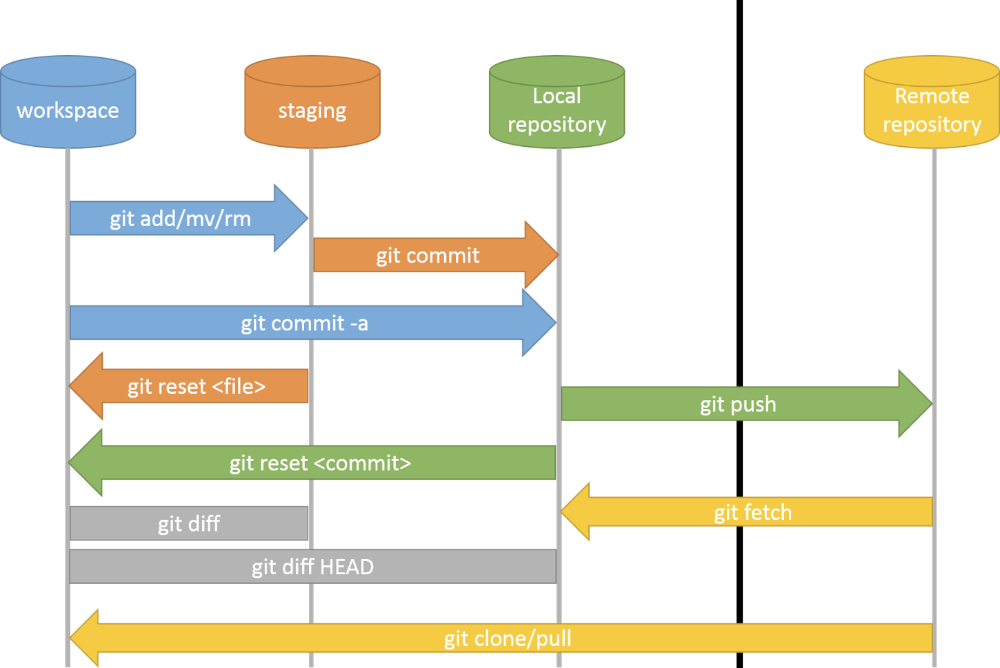
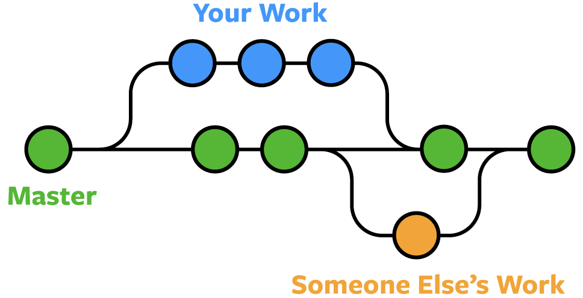

# Git beginners guide

Git is a distributed version control system that tracks versions of files.

## Features

* Distributed code management
* History for each file
* Cryptographically secured
* De-facto-Standard
* Available for many platforms

## Basic git commands

| Commands                     | Description                           |
|------------------------------|---------------------------------------|
| git clone                    | download to working space             |
| git status, log, diff        | shoe status, hitory, differences      |
| git add, rm, mv, commit      | transfer change to git                |
| git branch, checkout, switch | manages branches                      |
| git push, rebase, merge      | communication the remote repositories |

## Workflow



```bash
$ git clone git@github.com:voxpupuli/puppet-icinga2.git
$ cd puppet-icinga2
✔ ~/puppet-icinga2 [main|✔]
$ git branch
* main

✔ ~/puppet-icinga2 [main|✔]
$ vim metadata.json
✔ ~/puppet-icinga2 [main|✚ 1]
$ git status
On branch main
Your branch is up to date with 'origin/main'.

Changes not staged for commit:
  (use "git add <file>..." to update what will be committed)
  (use "git restore <file>..." to discard changes in working directory)
	modified:   metadata.json

no changes added to commit (use "git add" and/or "git commit -a")

✔ ~/puppet-icinga2 [main|✚ 1]
$ git add ./metadata.json
✔ ~/puppet-icinga2 [main|● 1]
$ git commit -m 'meaningful description'
✔ ~/puppet-icinga2 [main|✔] 
$ git push
Enumerating objects: 5, done.
Counting objects: 100% (5/5), done.
Writing objects: 100% (3/3), 257 bytes | 257.00 KiB/s, done.
Total 3 (delta 0), reused 0 (delta 0), pack-reused 0 (from 0)
To /root/repo
   1a2190b..3747668  main -> main
```

## Branches

* Create
  * git branch \<branch name>; git checkout <branch name>
  * git switch -c \<branch name>
  * git checkout -c \<branch name>
* Check state
  * git status
* Rename
  * git branch -m \<new branch name> (current)
  * git branch -m \<branch name> \<new branch name>
* Merge
  * git merge \<branch name> (in current)
  * git merge \<branch A> \<branch B> (branch A in B)
* Delete
  * git branch -d \<branch name> 



```bash
✔ ~/puppet-icinga2 [main|✔]
$ git checkout -b lbetz/fix-433
Switched to a new branch 'lbetz/fix-433'
✔ ~/puppet-icinga2 [lbetz/fix-433 L|✔]

$ vim metadata.json
✔ ~/puppet-icinga2 [lbetz/fix-433 L|✚ 1]
$ git commit -a -m 'meaningful description'
✔ ~/puppet-icinga2 [lbetz/fix-433 L|✔]

$ git checkout main
✔ ~/puppet-icinga2 [main|✔]
$ git merge lbetz/fix-433
Updating 3747668..29907a5
Fast-forward
 metadata.md | 1 +
 1 file changed, 1 insertion(+)
✔ ~/puppet-icinga2 [main|✔]

git branch -d lbetz/fix-433
Deleted branch lbetz/fix-433 (was 29907a5).
✔ ~/puppet-icinga2 [main|✔]

```

## Working with remote repositories

* Connection
  * git add \| rm remote \<remote name> \<URL>
* Synchronize
  * git pull \[remote name]
  * git push \[remote name] \[branch name]
* Delete
  * git branch -D \<branch name> (non synchronized)
  * git push \<remote name> --delete \<branch name>
  
```bash
$ git push origin lbetz/fix-433
Enumerating objects: 5, done.
Counting objects: 100% (5/5), done.
Writing objects: 100% (3/3), 270 bytes | 270.00 KiB/s, done.
Total 3 (delta 0), reused 0 (delta 0), pack-reused 0 (from 0)
To git@github.com:voxpupuli/puppet-icinga2.git
 * [new branch]      lbetz/fix-433 -> lbetz/fix-433
✔ ~/puppet-icinga2 [lbetz/fix-433 L|✔]

$ git push origin --delete lbetz/fix-433
To git@github.com:voxpupuli/puppet-icinga2.git
 - [deleted]         lbetz/fix-433
✔ ~/puppet-icinga2 [main|✔]
```
