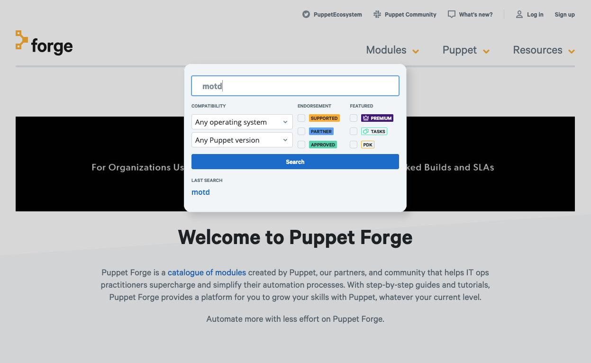
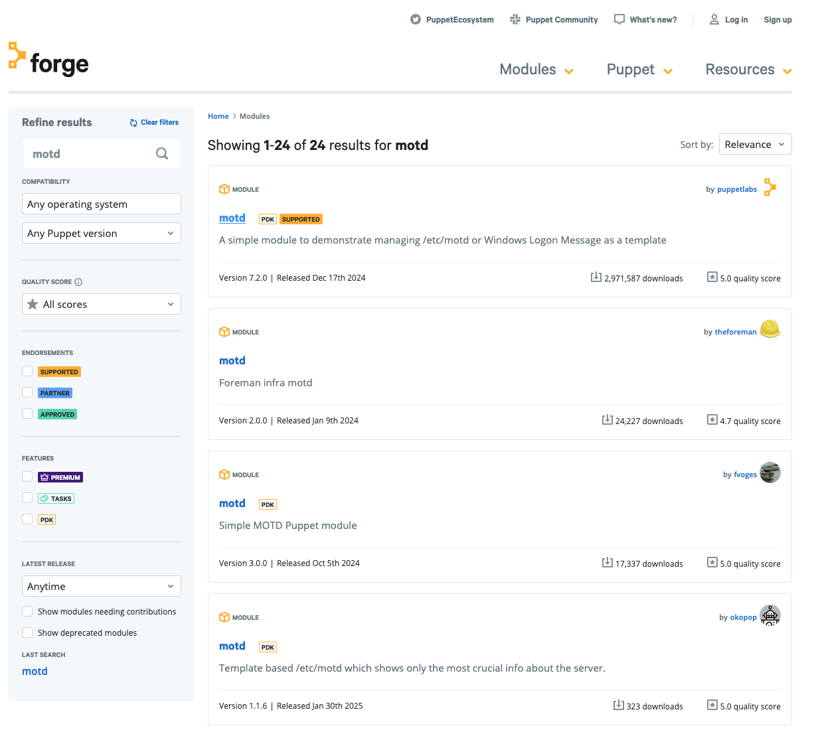

# Sample Solution

## Puppet Forge

* Importent: Change into your puppet environment directory

```bash
    $ cd ~/puppetcode
```

* Search the forge for a module `motd`

Open a new browser tab or windows, navigate to [https://forge.puppet.com](https://forge.puppet.com)

   

and search for `motd`.

   

* Use `puppet module install` to download and install the module motd into your `./modules` directory

```bash
    $ puppet module install puppetlabs/motd
    Notice: Preparing to install into /etc/puppetlabs/code/environments/production/modules ...
    Notice: Downloading from https://forgeapi.puppet.com ...
    Notice: Installing -- do not interrupt ...
    /etc/puppetlabs/code/environments/production/modules
    └─┬ puppetlabs-motd (v7.2.0)
      ├── puppetlabs-registry (v5.0.3)
      └── puppetlabs-stdlib (v9.7.0)
```

* Check the content of your `./modules` directory

```bash
    $ ls modules/
    motd  registry  stdlib
```
